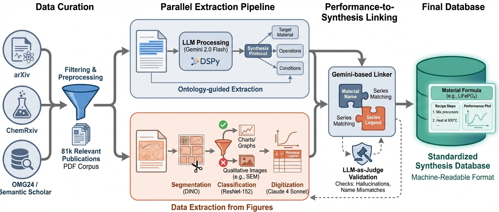

# Architecture & Pipeline

LeMat-Synth uses a modular pipeline architecture built on [Hydra](https://hydra.cc/) for configuration management and [DSPy](https://dspy.ai/) for structured LLM interactions.

## Pipeline Overview

## Core Modules

### Data Loader

Loads papers from various sources via a common `PaperLoaderInterface`:

- **HFLoader** — loads from HuggingFace datasets (`LeMaterial/LeMat-Synth-Papers`)
- **FSPaperLoader** — loads from local or cloud filesystem via `fsspec`
- **AnnotationHFLoader** — loads annotated papers for evaluation

Each paper is represented as a `Paper` object containing `publication_text`, `si_text` (supplementary info), `name`, and `id`.

### Material Extraction

Identifies synthesized materials from paper text using the `DspyTextExtractor`. Takes full paper text as input, returns comma-separated chemical formulas (e.g., `Sr3(P3O9)2·7H2O, LiH2PO3`).

Uses temperature escalation retry strategy: `[0.0, 0.3, 0.5]` — if deterministic extraction fails, the model is given progressively more freedom.

### Synthesis Extraction

For each identified material, `DspySynthesisExtractor` extracts a structured `GeneralSynthesisOntology`:

- **Target compound** — name, formula, and type (16 categories: metals, ceramics, polymers, nanomaterials, etc.)
- **Synthesis method** — one of 35+ methods (PVD, CVD, sol-gel, hydrothermal, etc.)
- **Starting materials** — name, vendor, amount, unit, purity
- **Process steps** — ordered steps with action (add/mix/heat/cool/filter/etc.), materials, equipment, and conditions
- **Equipment** — name, vendor, settings
- **Conditions** — temperature, duration, pressure, atmosphere, stirring, pH

### Judge Evaluation

LLM-based quality assessment via `DspyGeneralSynthesisJudge`. Each extraction is scored 1-5 across seven criteria:

1. **Structural Completeness** — all synthesis components captured
2. **Material Extraction** — correct names, quantities, units, purities
3. **Process Steps** — accurate order and action classification
4. **Equipment Extraction** — all equipment identified
5. **Conditions Extraction** — temperature, time, atmosphere, pressure
6. **Semantic Accuracy** — scientific meaning preserved
7. **Format Compliance** — ontology schema adherence

A separate `DspyLinkingJudge` evaluates synthesis-to-performance-data linking with 4 scores and 9 failure mode flags.

### Result Save

Stores results to filesystem (local or GCS) via `SynthesisFSResultGather`. Output includes `result.json`, raw texts, and cost reports per paper.

## Multi-LLM Ensemble

All extraction and evaluation stages support a multi-LLM mode where the same task is run across multiple models (e.g., Claude, Gemini, Qwen, DeepSeek) for robustness. Results are aggregated by `MultiLLMResultGather`.

## Technology Stack

| Component | Technology |
|-----------|------------|
| Configuration | [Hydra](https://hydra.cc/) |
| LLM Orchestration | [DSPy](https://dspy.ai/) |
| Multi-provider LLM access | [LiteLLM](https://docs.litellm.ai/) |
| Data models | [Pydantic](https://docs.pydantic.dev/) |
| Filesystem abstraction | [fsspec](https://filesystem-spec.readthedocs.io/) |
| PDF extraction | [Docling](https://github.com/DS4SD/docling), [Mistral OCR](https://docs.mistral.ai/) |
| Figure classification | ResNet-152, DINO |

## Configuration Flow

1. Hydra loads `examples/config/config.yaml`
2. Composes defaults for each pipeline stage
3. Each config uses `_target_` field for class instantiation
4. LLM configs are nested under `lm` in each extractor/judge
5. System prompts loaded from `examples/system_prompts/`

See the [Configuration Reference](../reference/configuration.md) for full parameter details.
