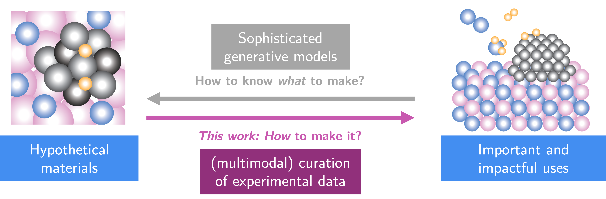

# 

An open-source multi-modal toolbox for extracting structured synthesis procedures and performance data from materials science literature at scale.

  <a href="https://arxiv.org/abs/2510.26824" class="md-button md-button--primary action-button">Paper</a>
  <a href="https://huggingface.co/datasets/LeMaterial/LeMat-Synth" class="md-button md-button--primary action-button">Dataset</a>
  <a href="https://github.com/LeMaterial/lematerial-llm-synthesis" class="md-button action-button">GitHub</a>

## Getting Started

### Tutorials
**Learning-oriented guides**

Step-by-step tutorials to get started with LeMat-Synth: installation, first extraction, and understanding the outputs.

[**Explore Tutorials**](tutorials/index.md)

### How-to Guides
**Task-oriented instructions**

Practical recipes for common tasks: extracting from HuggingFace, local extraction, and contributing to the project.

[**Browse How-to Guides**](how_to/index.md)

### Explanation
**Understanding-oriented context**

Understand LeMat-Synth's architecture, the multi-modal extraction pipeline, and the design decisions behind the toolbox.

[**Read Explanations**](explanation/index.md)

### Reference
**Information-oriented documentation**

Configuration reference, Hydra config options, and bibliographic resources.

[**View Reference**](reference/index.md)

## Key Features

- **Multi-Modal Extraction**: Extract structured data from both text and figures in scientific papers
- **Multi-LLM Support**: Works with Mistral, OpenAI, Google Gemini, and Anthropic Claude
- **Judge Evaluation**: Built-in LLM judges for quality assessment of extracted data
- **Hydra Configuration**: Flexible, composable configuration system
- **Case Studies**: Ready-to-use pipelines for superconductors and thermocatalysis

## Overview

